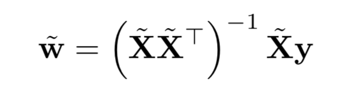
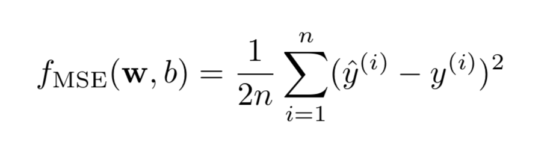

# linearSmile
Smile detectors based on linear regression

## ¯\\\_(ツ)_/¯

### What's inside?

- Analytical Smile Detector
- Gradient Descent Smile Detector

### Analytical Weight
`analytical_weight_detector.py` computes the optimal weights `w` and bias term `b` for the linear regression model by deriving the expression for the gradient of the cost function w.r.t. w and b, setting it to 0, and then solving.

The weight is computed as

<div align="center">
	
</div>

with the cost function of

<div align="center">
	
</div> 

### Gradient Descent

The algorithm picks a random starting value for `w` and `b` ∈ R and a small learning rate (e.g., ε = .001). (In my code, I sampled each component of w and b from a Normal distribution with standard deviation 0.01; use np.random.randn). Then, using the expression for the gradient of the cost function, iteratively update w,b to reduce the cost fMSE(w, b). Stop when the difference between fMSE over successive training rounds is below some “tolerance” (e.g., δ = 0.000001). After optimizing w and b only on the training set, compute and report the cost fMSE on the training set Dtr and (separately) on the testing set Dte. Both of these values should be very close to what you computed using Method 1. Note that this method of optimizing model weights is much more general than Method 1 above, at the expense of requiring some additional optimization hyperparameters

## Getting Started

### Prerequisite

- Python v3.6.4
- NumPy v1.14.0

### Running

#### Analytical Weight Detector
To test out the analytical weight detector, run the following command in the terminal:

```bash
python3 analytical_weight_detector.py
```

Here is an example output:

```bash
Training MSE: 0.052500
Testing MSE: 0.116247

Training Accuracy: 0.895000
Testing Accurary: 0.767505
```

#### Gradient Descent Detector
To test out the gradient descent detector, run the following command in the terminal:

```bash
python3 gradient_descent_detector.py
```

Here is an example output:

```bash
Start training the model
Training MSE: 0.064750
Testing MSE: 0.134026

Training Accuracy: 0.870500
Testing Accurary: 0.731947
```

## Authors

- **Ben Hylak** - *Initial work* - [bhylak](https://github.com/bhylak)

- **Yang Liu** - *Initial work* - [byliuyang](https://github.com/byliuyang)

## License
This repo is maintained under MIT license.